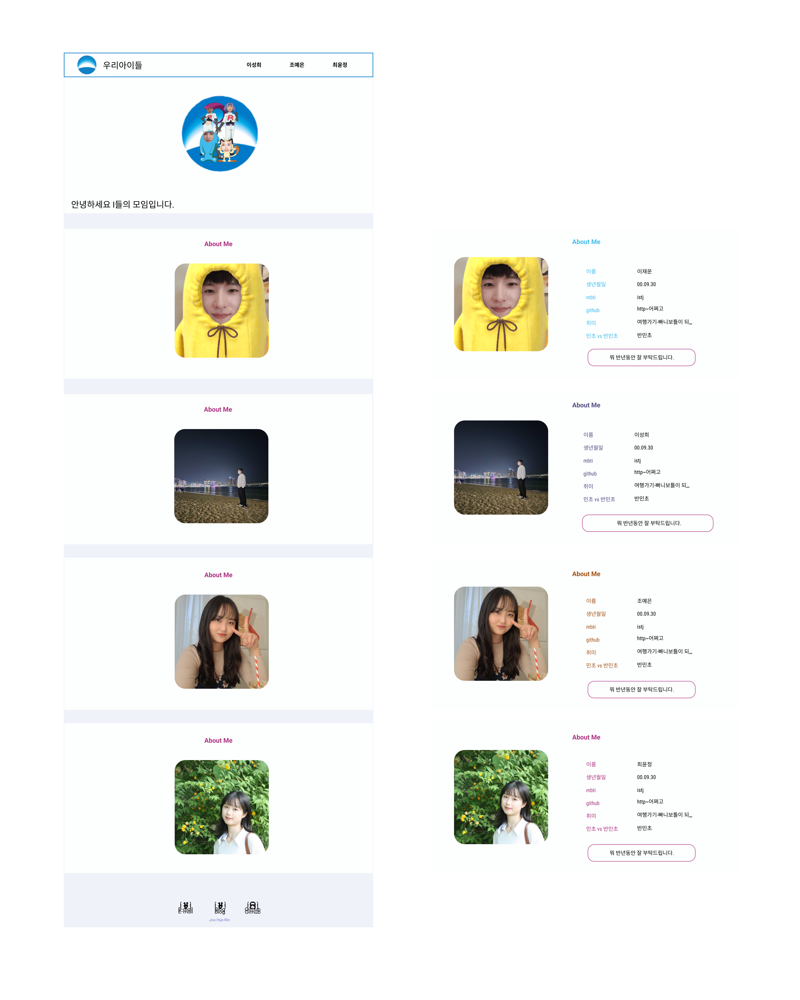
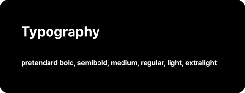

# 팀 소개 웹페이지

## 🍦 서비스 소개

우리 FISA HTML, CSS 토이 프로젝트

우리 아이들 팀 소개 웹 페이지입니다.

### 역할 분담
- 이성희 : 프로파일 아이템 및 애니메이션 적용
- 조예은 : 전체 레이아웃
- 최윤정 : 프로파일 아이템 상세 내용

  

## 💄 UI 스타일 가이드라인

### Layout

### Font
**[프리텐다드](https://noonnu.cc/font_page/694)**

### Color

  

## 📜 팀 규칙

### git convention
- feat : 새로운 기능을 추가하는 경우
- fix : 버그를 고친경우
- docs : 문서를 수정한 경우
- style : 코드 포맷 변경, 세미콜론 누락, 코드 수정이 없는경우
- refact : 코드 리펙토링
- test : 테스트 코드. 리펙토링 테스트 코드를 추가했을 때
- chore : 빌드 업무 수정, 패키지 매니저 수정
- design : CSS 등 사용자가 UI 디자인을 변경했을 때
- rename : 파일명(or 폴더명) 을 수정한 경우
- remove : 코드(파일) 의 삭제가 있을 때

### pr rule
- 1명 이상의 팀원 리뷰를 받아야 merge 가능
- pr 올린 사람이 merge 하기

  

## ✨ 이용 방법

  

## 🔗 배포 링크

[팀 소개 웹페이지](https://woorifisa-service-dev-3rd.github.io/frontend-1st-wooriIdle/)

  
