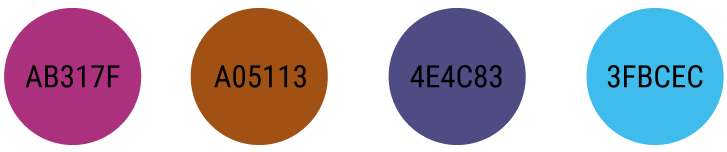

# 팀 소개 웹페이지

## 🍦 서비스 소개

우리 FISA HTML, CSS 토이 프로젝트

우리 아이들 팀 소개 웹 페이지입니다.

  

## 💄 UI 스타일 가이드라인

### layout

### font

### color

### git convention
- Fix : 버그를 고친경우
- Feat : 새로운 기능을 추가하는 경우
- Docs : 문서를 수정한 경우
- Style : 코드 포맷 변경, 세미콜론 누락, 코드 수정이 없는경우
- Refactor : 코드 리펙토링
- Test : 테스트 코드. 리펙토링 테스트 코드를 추가했을 때
- Chore : 빌드 업무 수정, 패키지 매니저 수정
- Design : CSS 등 사용자가 UI 디자인을 변경했을 때
- Rename : 파일명(or 폴더명) 을 수정한 경우
- Remove : 코드(파일) 의 삭제가 있을 때

  

## ✨ 이용 방법

  

## 🔗 배포 링크

[팀 소개 웹페이지](https://hyerrin.github.io/portfolio/)

  